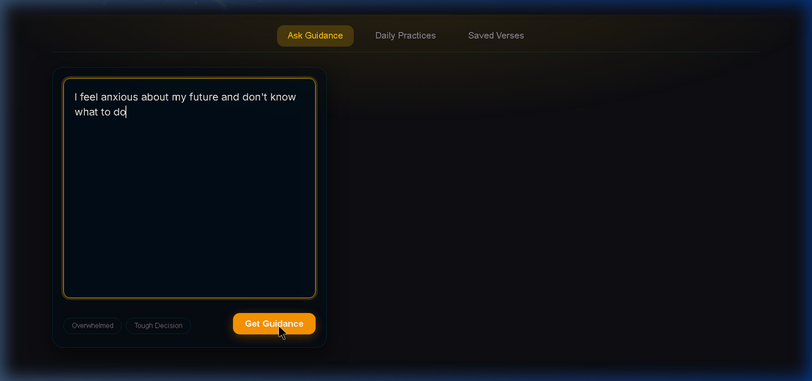
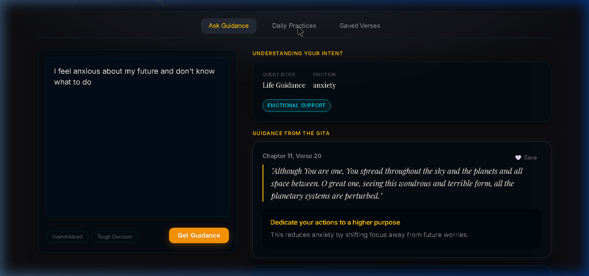
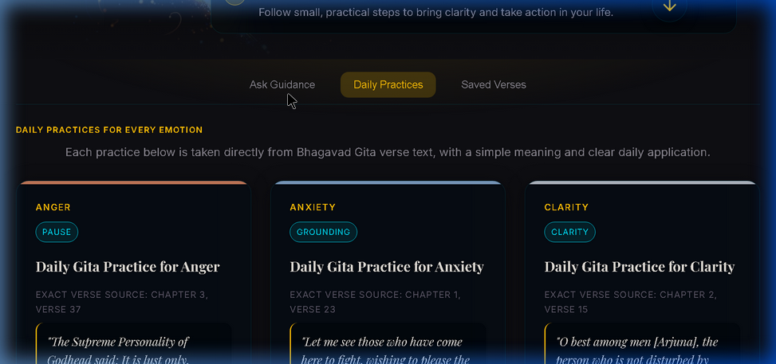
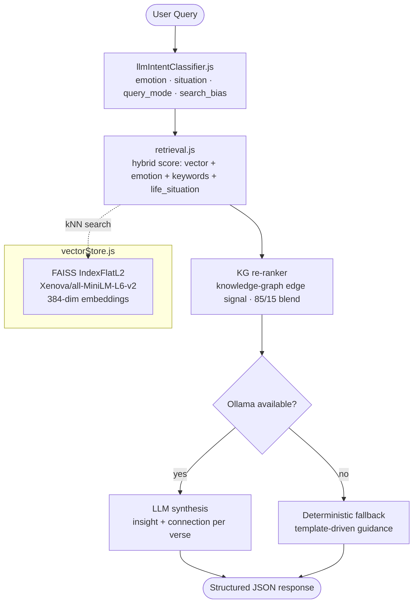

# Bhagavad-Gita AI Assistant

A production-oriented retrieval assistant over the Bhagavad-Gita corpus. Queries are understood through intent classification, answered via hybrid FAISS + knowledge-graph retrieval, and enhanced with an optional local LLM (Ollama). The system is entirely self-contained — no external API keys required to run.

---

## What reviewers should notice

- **Real RAG pipeline:** query → intent classification → hybrid vector + metadata retrieval → knowledge-graph re-ranking → LLM synthesis with deterministic fallback.
- **Self-healing index:** server auto-builds the FAISS index on first start if `data/faiss_index.bin` is missing.
- **Dual query modes:** emotional/action support and factual/informational study — each with a distinct response shape.
- **Observability:** structured JSON request log, `/stats` endpoint, `/health` endpoint, and replay artifacts in `outputs/`.
- **Separation of concerns:** embedding, retrieval, intent classification, practice generation, and HTTP serving are each in their own module.
- **No hard secrets:** all runtime configuration is env-var driven (see `.env.example`).

---

## Screenshots

**Landing Page** — Krishna artwork hero with step-by-step onboarding panel:


**Ask Guidance** — query input with emotional context tags; **AI Response** — intent classification panel (query mode, emotion, intent type) + verse cards with insights:

| Ask Guidance | AI Response |
|:---:|:---:|
|  |  |

**Daily Practices** — emotion-indexed card grid, each sourced from an exact Gita verse with a practical daily application:



---

## Repository layout

```
.
├── server.js                    # Express HTTP server — API surface + rate limiting
├── package.json                 # Node.js manifest (ESM, dependencies)
├── .env.example                 # Config template (copy to .env)
│
├── runtime/
│   ├── vectorStore.js           # FAISS index build/load/search (Xenova/all-MiniLM-L6-v2)
│   ├── retrieval.js             # Hybrid retrieval: vector + emotion/keyword/life-situation scoring + KG edges
│   ├── llmIntentClassifier.js   # LLM-based intent + emotion extraction (Ollama, with rule-based fallback)
│   ├── pipeline.js              # Main orchestrator: intent → retrieval → KG re-rank → LLM → response
│   └── practiceGenerator.js    # Rule-based daily practice suggestions keyed by emotion
│
├── data/
│   ├── verses.json              # 700+ verses with translations, keywords, emotion_tags, life_situations
│   ├── purports.json            # Commentary summaries and core ideas per verse
│   ├── metadata.json            # FAISS index metadata (auto-generated on first build)
│   └── faiss_index.bin          # Persisted FAISS flat L2 index (auto-generated on first build)
│
├── frontend/
│   ├── index.html               # Main chat UI (served as static files)
│   └── gita_assistant.html      # Standalone assistant demo
│
├── tools/
│   └── eval/
│       ├── retrieval_eval.js         # Evaluation harness: Precision@K, MRR, MAP, NDCG
│       └── retrieval_test_queries.json  # Labelled test query set
│
├── outputs/                     # Runtime-generated artifacts (gitignored)
│   ├── answers.json             # Last pipeline response
│   ├── history.json             # Rolling 50-entry session history
│   ├── requests.log             # Structured JSON request log (one entry per line)
│   └── retrieval_eval_results.json  # Latest eval run results
│
└── python-backend/              # Utility scripts (offline data prep only)
    ├── loader.py                # Document normalization and export
    ├── embeddings.py            # Offline embedding generation helper
    ├── search.py                # Python-side retrieval primitives
    └── requirements.txt
```

---

## Architecture



### Key design decisions

| Decision | Rationale |
|---|---|
| FAISS `IndexFlatL2` with unit-normalized vectors | Exact kNN; cosine similarity via `1 − d²/2` conversion; simple to persist and reload. |
| Hybrid scoring in `retrieval.js` | Vector similarity alone misses emotion/life-situation metadata; configurable per-query bias weights let the intent classifier tune the retrieval blend. |
| KG re-ranking (15% signal) | Edges in `verses.json` (`shared_principles`, `shared_emotion_tags`) provide graph-structural signal without a separate graph DB. |
| Deterministic fallback before LLM call | Response quality is guaranteed even when Ollama is unavailable or returns malformed JSON. |
| Dual query modes | Factual queries (e.g. "what does verse 2.47 say?") get a verse-study layout; emotional queries get guidance + practice + related verses. |
| Session memory (50-entry rolling) | Last 2 queries injected as context into the LLM prompt for conversational coherence. |

---

## Developer quickstart

**Prerequisites:** Node.js 18+, `npm`.  
Ollama is optional — the pipeline degrades gracefully to rule-based fallback if it is not running.

### 1. Install dependencies

```bash
npm install
```

### 2. Configure environment

```bash
cp .env.example .env
# Edit .env if you want to change the Ollama model or port
```

Key variables (all optional — defaults shown):

```
OLLAMA_BASE_URL=http://127.0.0.1:11434
OLLAMA_MODEL=llama3.2:1b
OLLAMA_TIMEOUT_MS=120000
TOP_K_RETRIEVAL=9
TOP_K_FINAL=3
PORT=3000
```

### 3. Start the server

```bash
npm run serve
# → http://localhost:3000
```

On first start the server will auto-build the FAISS index from `data/verses.json` (~2–3 min). Subsequent starts load the persisted `data/faiss_index.bin` instantly.

### 4. (Optional) Run with a local LLM

```bash
# Install Ollama from https://ollama.com, then:
ollama pull llama3.2:1b
# The server will detect it automatically on the next /ask call
```

---

## API reference

| Method | Endpoint | Description |
|---|---|---|
| `POST` | `/ask` | Main query endpoint. Body: `{ "query": "..." }` |
| `GET` | `/chapters` | All 18 chapters with verse counts, themes, and sample verse |
| `GET` | `/chapter/:n/verses` | All verses in chapter `n` |
| `GET` | `/daily-practices` | Practice suggestions for all supported emotions |
| `GET` | `/stats` | Aggregate stats from `outputs/requests.log` |
| `GET` | `/health` | Server health: uptime, vector store state, verse count |

**Rate limiting:** 15 requests per IP per minute.

### Example `/ask` response (emotional mode)

```json
{
  "understanding": {
    "query_mode": "emotional",
    "emotion": "anxiety",
    "emotion_confidence": 0.92,
    "situation": "career",
    "intent_type": "emotional_support"
  },
  "mode": "emotional",
  "guidance": [
    {
      "chapter": 2,
      "verse": 47,
      "translation": "You have a right to perform your prescribed duties...",
      "insight": "Focus on effort, not results",
      "connection": "Your anxiety comes from worrying about future outcomes"
    }
  ],
  "final_advice": "Take one small action today without worrying about results",
  "related_verses": [...],
  "practice": { ... }
}
```

---

## Evaluation

Run the retrieval evaluation harness against the labelled test query set:

```bash
npm run eval:retrieval
# Writes results to outputs/retrieval_eval_results.json
```

Metrics computed: Precision@K, Recall@K, MRR, MAP@K, NDCG@K.

---

## Observability

- **`GET /health`** — live server status, FAISS state, verse count, Node version.
- **`GET /stats`** — aggregated from `outputs/requests.log`: total requests, avg latency, LLM success rate, top emotions.
- **`outputs/requests.log`** — one structured JSON line per request; suitable for log pipeline ingestion.
- **`outputs/history.json`** — rolling 50-entry session history for replay-based QA.

---

## Python backend (utility, not required to run)

`python-backend/` contains offline data-preparation utilities used during corpus authoring. The live server is pure Node.js and does not depend on the Python scripts at runtime.

```bash
cd python-backend
pip install -r requirements.txt
python loader.py       # normalize and export documents
python embeddings.py   # generate embeddings offline (alternative to JS auto-build)
```

---
